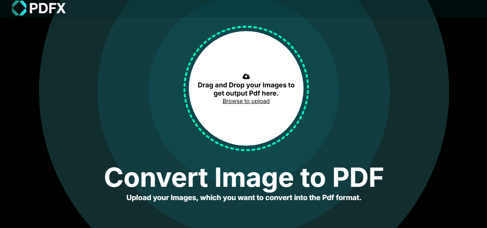

# 📄 PdfX – Image to PDF Converter


## 🚀 Description
PdfX is a web application that allows users to convert image files into PDF format. Built using Django, HTML, CSS, and JavaScript...


---
## 🌐 Live Demo

🔗 [Visit QRCodeX](https://pdfx-navin.onrender.com/)
## Kindly allow 30–40 seconds for the site to load.
## The project is hosted on Render's free tier, which means the server goes into hibernation when not in use. The first request after inactivity wakes it up, causing a delay of 30–40 seconds.

---

## 📸 Screenshot

  


---

## 🛠️ Tech Stack

- **Frontend**: HTML5, CSS3, JavaScript
- **Backend**: Python, Django
- **Deployment**: Render

---

## ✨ Features

- ✅ Upload image files (JPG, PNG, JPEG)
- ✅ Instantly convert them to PDF format
- ✅ Automatically triggers PDF download after conversion
- ✅ Clean and mobile-friendly user interface
- ✅ Simple, fast, and secure

---

## 📁 Project Structure

```bash
PdfX/
├── PdfX/             # Main Django project
├── testapp/          # App for handling PDF conversion logic
│ ├── templates/      # HTML templates
│ ├── static/         # CSS and image assets
├── media/            # Uploaded images (if any)
├── screenshot.png    # Screenshot image for README
├── requirements.txt  # Project dependencies
├── manage.py         # Django management file
└── README.md         # Project readme
```

---

## 🧠 How It Works

1. User selects an image file using the upload form.
2. Django handles the upload, converts the image to PDF using Pillow or reportlab.
3. The converted PDF file is sent back to the browser and downloaded automatically.

---

## 👨‍💻 Author

**Navin Kumar**

* [💼 LinkedIn](https://linkedin.com/in/geekynavin)
* [🐱 GitHub](https://github.com/geekynavin)
* [📫 Email](mailto:navin.sarni@gmail.com)

> Designed and Developed with ❤️ by Navin Kumar.

---

## 📃 License

This project is licensed under the [MIT License](./LICENSE).


